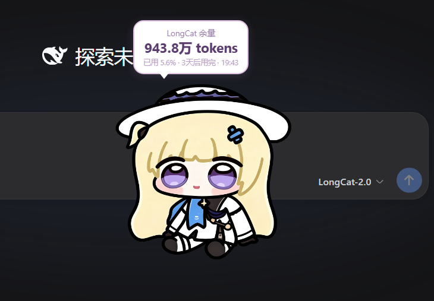
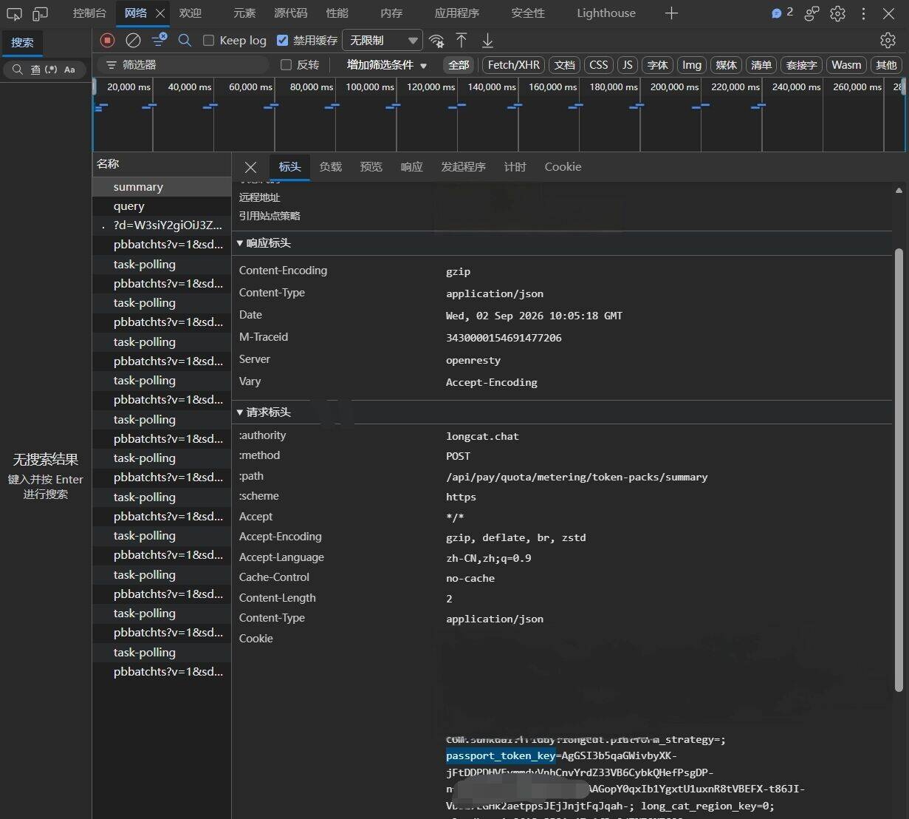

# DSH Balance Phoebe — 鸣潮菲比余额挂件

个人自用鸣潮菲比查 longcat 剩余 token 挂件，灵感来自 [dsh-whale-widget](https://github.com/MeteorNOX/DeepSeek-Balance-Whale-Widget)。

<div align="center"></div>

---

## 图片获取全流程

### 1. 豆包提示词生成

使用豆包（字节跳动 AI）生成鸣潮菲比角色图片。

- 编写提示词描述菲比形象（服饰、姿态、背景等）
- 生成满意的图片后保存到本地

### 2. Photopea 在线抠图（移除背景）

操作步骤：

1. 打开 https://www.photopea.com/
2. 导入图片：拖拽步骤 1 保存的图片
3. 菜单栏点击 `选择` → `主体`——自动识别人物区域
4. 反选并删除背景：`Shift+Ctrl+I`（反选）→ `Ctrl+X`（剪切删除背景）
5. 导出透明 PNG：`文件` → `另存为` → 选择 `PNG` 格式 → 保存


## 安装

```powershell
# 在仓库根目录执行
dsh plugin --profile web add "github:BlueChonk/dsh-balance-phoebe"

# 重启 dsh web
dsh web
```

---

## 配置指南

### LongCat Token 获取

本插件需要 LongCat 的 `LONGCAT_PASSPORT_TOKEN_KEY` 参数来获取余额信息。

#### 获取步骤：

1. 访问 https://longcat.chat/platform/usage 并登录
2. 按 `F12` 打开浏览器开发者工具
3. 在开发者工具中切换到 `Network`（网络）标签页
4. 刷新页面，找到 `https://longcat.chat/api/pay/quota/metering/token-packs/summary` 请求
5. 点击该请求，在 `Headers` 标签页中找到 `Cookie` 字段
6. 从 Cookie 中复制 `passport_token_key` 的值




#### 配置方法：

将获取到的 `passport_token_key` 填写到 `.dsh/.credentials.yaml` 文件中：

```yaml
# .dsh/.credentials.yaml
refs:
    LONGCAT_PASSPORT_TOKEN_KEY: "你的passport_token_key值"
```

**注意：** 请妥善保管你的 Token，不要将其提交到公开仓库或分享给他人。

---

## 功能特性

### 基础交互
- 鸣潮菲比角色挂件，悬浮显示在页面右下角
- 拖拽移动 + 左右贴边吸附
- 滚轮缩放挂件大小（0.6x ~ 2.5x），自动保存到 localStorage
- 按压音效（单音频文件，简洁设计）
- 位置记忆：基于相对边框距离记录位置，窗口大小变化后仍保持相对位置

### 压扁动画
- 按压时保持压扁状态，松手快速恢复（无延迟回弹）
- 长按不松手期间持续压扁
- 拖拽时同样保持压扁状态（长按 = 拖拽 = 压扁）
- 快速点击时瞬间恢复

### 余额气泡
- 点击挂件显示 LongCat Token 余额气泡
- 气泡智能边界检测：挂件靠近视口顶部时自动向下弹出，避免超出可视区域
- 气泡文字跟随左右吸附方向自动翻转
- 余额数据 60s 自动刷新，缓存 25s 减少请求

### 安全特性
- Token 通过 DSH Credentials System 安全管理，不明文存储
- 全链路安全响应头（CSP、X-Content-Type-Options、Referrer-Policy）
- 所有 API 端点速率限制（10 req/s/IP）
- 输入输出严格校验，错误消息模糊化处理